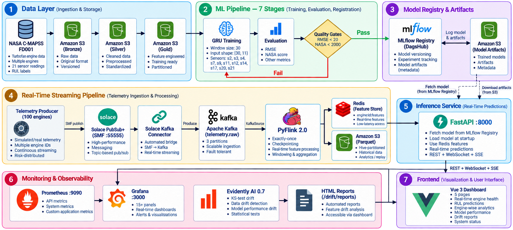
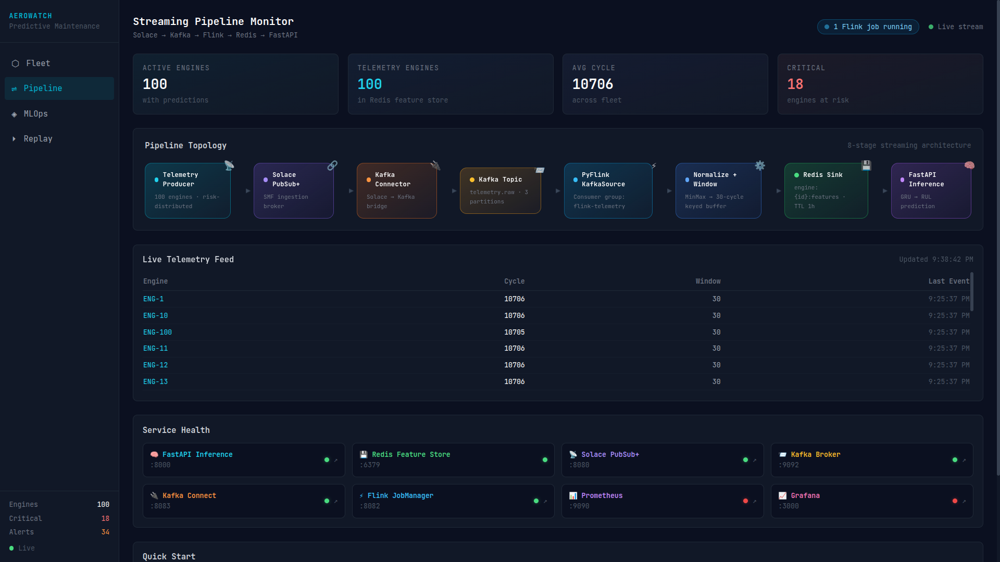
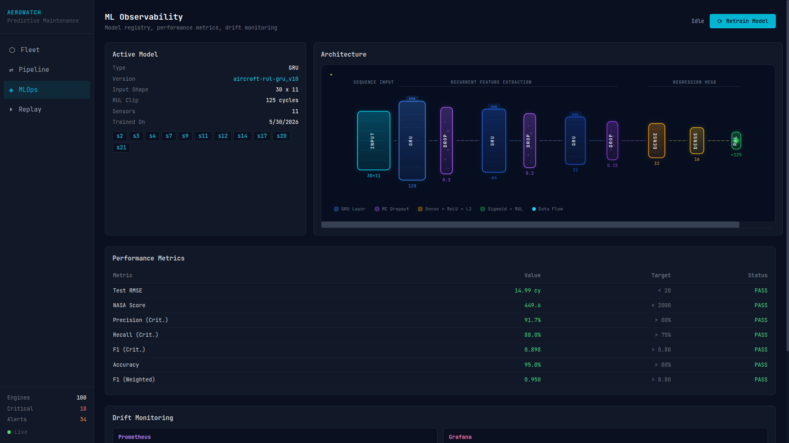
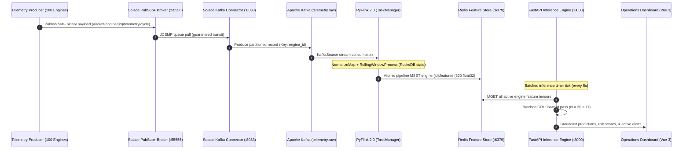

# Real-Time Aircraft Engine Predictive Maintenance System

[](https://www.python.org/)
[](https://www.tensorflow.org/)
[](https://flink.apache.org/)
[](https://kafka.apache.org/)
[](https://solace.com/)
[](https://redis.io/)
[](https://fastapi.tiangolo.com/)
[](https://vuejs.org/)
[](https://mlflow.org/)
[](https://www.evidentlyai.com/)
[](https://prometheus.io/)
[](https://grafana.com/)

An enterprise-grade, distributed predictive maintenance and telemetry processing platform. It ingests high-frequency turbofan sensor telemetry across a simulated 100-engine fleet, computes rolling temporal features via stream processing, serves real-time Remaining Useful Life (RUL) inferences with Bayesian uncertainty quantification, and continuously tracks model degradation and sensor drift.

---

## 🏗️ High-Level Architecture

---

## ⚡ Production Engineering Highlights

* **Distributed Ingestion & Streaming Fabric**: Solace PubSub+ (SMF binary protocol) bridges telemetry into an Apache Kafka event log (KRaft mode, 3 partitions) via Solace Kafka Connector.
* **Stateful Stream Processing**: Apache Flink 2.0 (`pyflink-connector-kafka`) maintains keyed RocksDB state with 30-cycle tumbling/sliding windows, checkpointing exactly-once guarantees every 60s.
* **Online & Offline Dual Sinks**: Sub-millisecond inference features are pushed to a Redis Feature Store (`float32[330]` tensors with 1h TTL), while historical telemetry flushes to S3 Parquet (Hive-partitioned by `date/hour`).
* **Deep Sequence Model**: 3-layer Gated Recurrent Unit (GRU 128 → 64 → 32) with dropout regularization, dense regression head, and target normalization ($RUL / 125$).
* **Bayesian Uncertainty Quantification**: Monte Carlo Dropout (30 stochastic forward passes at inference) yields epistemic uncertainty bounds and confidence intervals: $\text{conf} = 1 - 10 \cdot \sigma(\hat{y})$.
* **Vectorized WebSocket Inference**: FastAPI batches fleet-wide feature tensors into a single forward pass ($N \times 30 \times 11$) every 5s, achieving $O(1)$ model inference calls regardless of fleet scale.
* **Continuous Observability**: Prometheus scraping + 15-panel Grafana dashboard + Evidently AI 0.7 KS-test drift reports embedded directly inside an operations UI.

---

## 📊 Validated Model Benchmarks (NASA C-MAPSS FD001)

Evaluation results on the 100-engine test set with piece-wise linear target clipping ($RUL_{\text{max}} = 125$ cycles):

| Metric | Measured Value | Production Gate | Tolerance Status |
| :--- | :--- | :--- | :--- |
| **Root Mean Squared Error (RMSE)** | **14.99 cycles** | $< 20.0$ cycles | **PASS** (Optimal) |
| **NASA Asymmetric Penalty Score** | **449.6** | $< 2000.0$ | **PASS** (Strict penalty on late predictions) |
| **Critical Regime Precision** | **91.7%** | $> 80.0\%$ | **PASS** |
| **Critical Regime Recall** | **88.0%** | $> 75.0\%$ | **PASS** |
| **Critical F1 Score** | **0.898** | $> 0.80$ | **PASS** |
| **Overall Classification Accuracy** | **95.0%** | $> 80.0\%$ | **PASS** |
| **Weighted F1 Score** | **0.950** | $> 0.80$ | **PASS** |

### Mathematical Formulations

$$\text{Piecewise Target:}\quad y_t = \min\left(1.0, \frac{\max(0, T_{\text{fail}} - t)}{125}\right)$$

$$\text{NASA Asymmetric Penalty:}\quad S = \sum_{i=1}^{N} h(d_i), \quad h(d_i) = \begin{cases} e^{-d_i/13} - 1, & d_i < 0 \text{ (Early prediction)} \\ e^{d_i/10} - 1, & d_i \ge 0 \text{ (Late / Dangerous prediction)} \end{cases}$$

---

## 🔬 Model Evaluation & Error Analytics

The model training pipeline outputs comprehensive statistical diagnostics to validate boundary stability and tail-degradation reliability:

| Error Distribution & True vs Predicted | Convergence & Loss Curves |
| :---: | :---: |
|  |  |

| RUL Bucket Error & Confusion Matrix | Multi-Class Classification Report |
| :---: | :---: |
|  |  |

---

## 🖥️ Live Operations & UI Console (Vue 3 + Vite)

The frontend is an industrial 5-page SPA powered by Vue 3, TypeScript, TailwindCSS, Pinia, and Apache ECharts, ingesting three real-time WebSocket channels:

| Fleet Command Center (`/`) | Pipeline Topology Monitor (`/pipeline`) |
| :---: | :---: |
|  |  |

| MLOps Retraining & Drift (`/mlops`) | Hardware-in-the-Loop Replay Lab (`/replay`) |
| :---: | :---: |
|  |  |

| Prometheus & Grafana Observability (`:3000`) | Deep Sequence Architecture (`128 → 64 → 32`) |
| :---: | :---: |
|  |  |

---

## 🔄 7-Stage Automated MLOps Pipeline

The pipeline is orchestrated via `main.py` with full artifact tracking on DagsHub MLflow and Amazon S3:

```mermaid
flowchart LR
    S1["1. Data Ingestion\nS3 Bronze → Local"] --> S2["2. Data Validation\nSchema & Null Check"]
    S2 --> S3["3. Transformation\nParquet + Global Scaler"]
    S3 --> S4["4. Feature Engineering\n30×11 Sequence Windowing"]
    S4 --> S5["5. Model Training\n3-Layer GRU + Adam"]
    S5 --> S6["6. Model Evaluation\nRMSE, NASA, F1, Matrix"]
    S6 --> S7["7. Model Registry\nQuality Gate & S3 Artifacts"]

    style S1 fill:#1e293b,stroke:#0ea5e9,color:#fff
    style S2 fill:#1e293b,stroke:#0ea5e9,color:#fff
    style S3 fill:#1e293b,stroke:#0ea5e9,color:#fff
    style S4 fill:#1e293b,stroke:#0ea5e9,color:#fff
    style S5 fill:#1e293b,stroke:#0ea5e9,color:#fff
    style S6 fill:#1e293b,stroke:#0ea5e9,color:#fff
    style S7 fill:#1e293b,stroke:#22c55e,color:#fff
```



Trigger on-demand retraining with non-blocking subprocess spawning and SSE live stream logs:

```bash
# Trigger pipeline execution
curl -X POST http://localhost:8000/pipeline/run

# Subscribe to real-time execution stream
curl -N http://localhost:8000/pipeline/logs
```

---

## 📡 Distributed Streaming Topology



---

## 🐳 Docker Stack & Service Topology

The environment is packaged into a zero-leakage 13-service Docker Compose infrastructure:

| Container | Image / Recipe | Port Mapping | Memory Limit | Core Functionality |
| :--- | :--- | :--- | :--- | :--- |
| `aircraft-frontend` | `Dockerfile.frontend` (Nginx + Vue) | `5173:80` | `256M` | Static SPA + Reverse Proxy |
| `aircraft-engine-api` | `Dockerfile` (FastAPI + TF 2.17) | `8000:8000` | `1.5G` | REST / WebSocket / Retraining API |
| `aircraft-redis` | `redis:7.2-alpine` | `6379:6379` | `256M` | Online Sub-ms Feature Store |
| `aircraft-kafka` | `confluentinc/cp-kafka:7.6.0` | `9092, 29092` | `1.0G` | KRaft Event Log (`telemetry.raw`) |
| `aircraft-kafka-connect` | `confluentinc/cp-kafka-connect:7.6.0` | `8083:8083` | `768M` | Solace-to-Kafka Managed Source Connector |
| `aircraft-solace` | `solace/solace-pubsub-standard:latest` | `8080, 55555` | `1.5G` | Enterprise SMF Message Broker |
| `aircraft-flink-jobmanager` | `flink:2.0-scala_2.12` | `8082:8081` | `1.0G` | Flink Cluster Coordinator & Web UI |
| `aircraft-flink-taskmanager` | `Dockerfile.streaming` | — | `1.5G` | 3 Task Slots + RocksDB Operator Runtime |
| `aircraft-producer` | `Dockerfile.streaming` | — | `256M` | Risk-Distributed 100-Engine Fleet Simulator |
| `aircraft-prometheus` | `prom/prometheus:v2.50.0` | `9090:9090` | `256M` | 15s Scrape Engine + Time Series Storage |
| `aircraft-grafana` | `grafana/grafana:10.3.0` | `3000:3000` | `256M` | Pre-provisioned 15-Panel Visual Analytics |
| `aircraft-node-exporter` | `prom/node-exporter:v1.7.0` | `9100:9100` | `128M` | Host & Container OS Metrics |
| `aircraft-redis-exporter` | `oliver006/redis_exporter:v1.58.0` | `9121:9121` | `128M` | Feature Store Key & Memory Telemetry |

---

## 🚀 Quick Start Runbook

### 1. Launch Core Infrastructure (Lightweight: ~2.4GB RAM)
```bash
git clone https://github.com/nasim-raj-laskar/Real-Time-Aircraft-Engine-Predictive-Maintenance-System.git
cd Real-Time-Aircraft-Engine-Predictive-Maintenance-System

cp .env.example .env
# Set: AWS_ACCESS_KEY_ID, AWS_SECRET_ACCESS_KEY, AWS_S3_BUCKET, DAGSHUB_TOKEN, MLFLOW_TRACKING_URI

docker compose up -d
```

### 2. Launch Complete Streaming & Monitoring Ecosystem
```bash
# Enable Kafka, Flink, Solace, Prometheus, and Grafana
docker compose --profile streaming --profile monitoring up -d
```

### 3. Service Access Matrix

| Service Interface | Endpoint | Default Credentials |
| :--- | :--- | :--- |
| **Fleet Operations Dashboard** | `http://localhost:5173` | Public |
| **FastAPI Swagger Docs** | `http://localhost:8000/docs` | Public |
| **Apache Flink Web UI** | `http://localhost:8082` | Public |
| **Kafka Connect REST API** | `http://localhost:8083/connectors` | Public |
| **Solace Admin Management** | `http://localhost:8080` | `admin` / `admin` |
| **Grafana Monitoring Suite** | `http://localhost:3000` | `admin` / `admin` |
| **Prometheus Raw Metrics** | `http://localhost:9090` | Public |

---

## 📡 Production API Reference

```
POST /predict                     # Direct inference from normalized float32[30, 11]
POST /predict/raw                 # Inference from raw unscaled sensor dictionary
GET  /predict/engine/{id}         # Online inference querying Redis feature store
GET  /predict/stream/{id}         # Push-buffer replay inference
POST /push                        # Push ad-hoc sensor frame into engine buffer
GET  /engines                     # Active fleet catalog + latest health states
GET  /alerts                      # Real-time HIGH and CRITICAL engine alert filter
GET  /health                      # API & subsystem health probe
GET  /model/info                  # Model metadata, input tensor shapes, sensor schema
GET  /model/evaluation            # Live evaluation metrics from model registry
GET  /metrics                     # Prometheus scrape endpoint (9 custom telemetry gauges)
POST /pipeline/run                # Trigger asynchronous pipeline retraining
GET  /pipeline/status             # Retraining status (idle | running | success | failed)
GET  /pipeline/logs               # Server-Sent Events (SSE) live pipeline build log
GET  /drift/reports               # Enumerate Evidently AI 0.7 HTML drift reports
GET  /drift/reports/{filename}    # Serve interactive Evidently drift visualization
WS   /ws/predictions              # 5s interval fleet-wide vectorized batch prediction stream
WS   /ws/telemetry                # 2s interval raw sensor telemetry stream
WS   /ws/alerts                   # 5s interval high-priority fleet risk alerts
```

---

## 📂 Exhaustive Documentation Slices

Deep-dive architecture specifications are organized in the [`docs/`](docs/00_index.md) directory:

* [`docs/00_index.md`](docs/00_index.md) — Documentation index, quick reference, and global topology.
* [`docs/01_dataset.md`](docs/01_dataset.md) — NASA C-MAPSS dataset physics, sensor breakdown, and operating regimes.
* [`docs/02_preprocessing.md`](docs/02_preprocessing.md) — Deterministic sensor filtration, piecewise RUL target formulation.
* [`docs/03_feature_engineering.md`](docs/03_feature_engineering.md) — Sequence windowing, target normalization, and temporal structures.
* [`docs/04_model_training.md`](docs/04_model_training.md) — 3-layer GRU design, MC Dropout Bayesian uncertainty, MLflow gates.
* [`docs/05_inference_service.md`](docs/05_inference_service.md) — FastAPI asynchronous runtime, WebSocket loops, Prometheus telemetry.
* [`docs/06_streaming_pipeline.md`](docs/06_streaming_pipeline.md) — Solace SMF, Kafka KRaft, PyFlink 2.0 RocksDB stream execution.
* [`docs/07_monitoring.md`](docs/07_monitoring.md) — Prometheus rules, Grafana provisioning, Evidently AI 0.7 KS-drift.
* [`docs/07.1_UI.md`](docs/07.1_UI.md) — Vue 3 reactive architecture, Pinia state stores, simulation lab.
* [`docs/08_project_structure.md`](docs/08_project_structure.md) — Clean codebase layout, component separation, artifact lifecycle.
* [`docs/09_architecture.md`](docs/09_architecture.md) — End-to-end multi-tier system diagrams and deployment sequences.

---

## ⚖️ License
Released under the [MIT License](LICENSE). Built for high-reliability mission-critical predictive maintenance research and production deployments.
