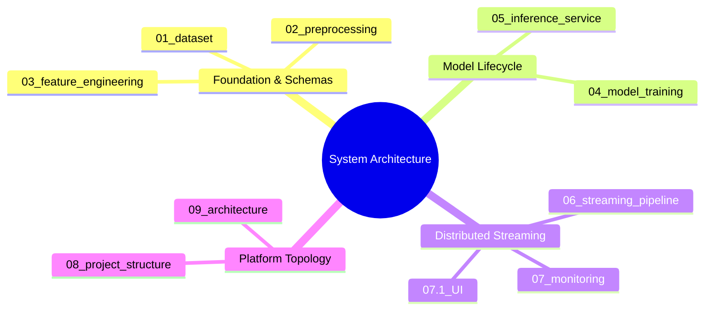

# Engineering Documentation Index

## Real-Time Aircraft Engine Predictive Maintenance System

A high-throughput, low-latency predictive maintenance platform for commercial turbofan engines. Built on NASA C-MAPSS degradation datasets, combining event-driven streaming, stateful window operators, Bayesian sequence modeling, and real-time fleet operations.

---

## 🗺️ Architectural Topic Map

---

## 📚 Specification Matrix

| Module | Specification | Primary Focus & Deliverables |
| :--- | :--- | :--- |
| **01** | [Dataset Reference](01_dataset.md) | NASA C-MAPSS FD001 physical schema, sensor variance analysis, degradation dynamics |
| **02** | [Preprocessing Pipeline](02_preprocessing.md) | Uninformative sensor filtering, piecewise linear RUL target formulation, MinMaxScaler bounds |
| **03** | [Feature Engineering](03_feature_engineering.md) | $30 \times 11$ temporal window generation, target normalization, zero-padding, leakage prevention |
| **04** | [Model Training & Registry](04_model_training.md) | 3-layer GRU topology, MC Dropout epistemic uncertainty, MLflow & S3 promotion gates |
| **05** | [Inference Service](05_inference_service.md) | FastAPI asynchronous runtime, 5s vectorized batch prediction loop, Prometheus instrumentation |
| **06** | [Streaming Pipeline](06_streaming_pipeline.md) | Solace PubSub+ SMF broker, Kafka KRaft log, PyFlink 2.0 RocksDB exactly-once windowing |
| **07** | [Monitoring & Observability](07_monitoring.md) | Prometheus metrics, 15-panel Grafana dashboard, Evidently AI 0.7 KS-test drift engine |
| **07.1** | [Operations Dashboard UI](07.1_UI.md) | Vue 3 + Vite 5-page SPA, Pinia reactive state stores, multi-channel WebSocket client |
| **08** | [Project Structure](08_project_structure.md) | Codebase directory tree, 7-stage pipeline orchestration, containerized microservice matrix |
| **09** | [System Architecture](09_architecture.md) | Multi-tier end-to-end architecture, message lifecycle sequence, container networking |

---

## 🧭 System Ingestion to Action Flow

---

## ⚡ Core Technical Parameters

| Domain | Configuration | Value / Strategy |
| :--- | :--- | :--- |
| **Sequence Geometry** | Temporal Window Size | **30 cycles** ($T = 30$) |
| **Feature Dimension** | Retained Sensor Channels | **11 physical sensors** ($D = 11$) |
| **Target Variable** | Piecewise RUL Ceiling | **125 cycles** ($\min(RUL, 125)$) |
| **Model Topology** | Sequence Backbone | **3-layer GRU** ($128 \rightarrow 64 \rightarrow 32$ units) |
| **Uncertainty Method** | Epistemic Uncertainty | **Monte Carlo Dropout** ($T = 30$ passes, active dropout) |
| **Stream State** | Flink State Backend | **EmbeddedRocksDBStateBackend** (incremental checkpoints) |
| **Checkpoint Interval** | Stream Reliability | **60,000 ms** (EXACTLY_ONCE mode) |
| **Feature Store Key** | Redis Online Tensor | `engine:{id}:features` (1320 bytes, 3600s TTL) |
| **Inference Frequency** | Vectorized WebSocket Loop | **5.0 seconds** ($N \times 30 \times 11$ single batch) |
