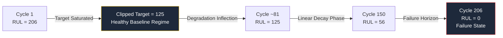

# Preprocessing Pipeline Specification

## Deterministic Data Transformation & Target Formulation

Raw C-MAPSS telemetry cannot be consumed directly by sequence architectures. The preprocessing stage enforces invariant column filtering, target clipping, global feature scaling, and group-aware partitioning without data leakage.

---

## 🔄 Transformation Topology

```mermaid
flowchart TD
    A[Raw FD001 Records\n26 Columns · Space-Delimited] --> B[Filter Zero-Variance Sensors\nDrop 10 uninformative channels]
    B --> C[Compute Monotonic RUL\nRUL = max_cycle − current_cycle]
    C --> D[Piecewise Linear Clipping\nSaturate RUL at 125 cycles]
    D --> E[Global MinMax Scaling\nFit on Train only → [0, 1]]
    E --> F[Group-Aware Partitioning\nGroupShuffleSplit by Engine Unit]
    F --> G[Normalized Intermediate Parquet\nReady for Sliding Window Operator]

    style A fill:#1e293b,stroke:#0ea5e9,color:#fff
    style G fill:#1e293b,stroke:#22c55e,color:#fff
```

---

## 1. Zero-Variance Sensor Filtration

Ten sensors exhibit near-zero variance ($\sigma^2 \approx 0$) across all operating cycles, containing no degradative telemetry signal:

* **Discarded Sensors (10)**: `s1, s5, s6, s8, s10, s13, s15, s16, s18, s19` (plus operational setting `os3` which is fixed at 100.0).
* **Retained Telemetry Channels (11)**:
  * `s2` (Total Temp at LPC Outlet, T24)
  * `s3` (Total Temp at HPC Outlet, T30)
  * `s4` (Total Temp at LPT Outlet, T50)
  * `s7` (Total Pressure at HPC Outlet, P30)
  * `s9` (Physical Core Speed, Nc)
  * `s11` (Static Pressure at HPC Outlet, Ps30)
  * `s12` (Ratio of Fuel Flow to Ps30, phi)
  * `s14` (Corrected Core Speed, NRc)
  * `s17` (Bleed Enthalpy, htBleed)
  * `s20` (HPT Coolant Bleed, W31)
  * `s21` (LPT Coolant Bleed, W32)

---

## 2. Piecewise Linear Target Formulation

Engines operate with virtually no measurable degradation during initial operational cycles. Establishing a monotonic linear regression target across early cycles forces the model to fit non-existent degradation patterns.



$$RUL_{\text{target}}(t) = \min\left(RUL_{\text{max}}, \max\left(0, T_{\text{fail}} - t\right)\right), \quad RUL_{\text{max}} = 125$$

---

## 3. Global MinMax Normalization

To ensure numerical stability in recurrent gating units, feature scaling is strictly fitted on the training split and applied transitively to evaluation and streaming telemetry:

$$x_{\text{norm}}^{(i)} = \frac{x^{(i)} - \min(X_{\text{train}}^{(i)})}{\max(X_{\text{train}}^{(i)}) - \min(X_{\text{train}}^{(i)}) + \epsilon}, \quad \forall i \in \{1, \dots, 11\}$$

Parameters are exported to `artifacts/data_transformation/scaler.pkl` and compiled into `streaming/src/main/resources/scaler_params.csv` for stateless PyFlink worker initialization.

---

## 4. Leakage-Free Partitioning

Splits must be evaluated along the engine identity boundary rather than individual record rows. Random row-wise splitting causes temporal autocorrelation leakage where subsequent cycles of a test engine inform prior cycle training.

| Partition | Allocation Strategy | Engine Count | Total Rows | Target Leakage Risk |
| :--- | :--- | :--- | :--- | :--- |
| **Train Set** | `GroupShuffleSplit` (`unit`) | 80 engines | ~16,500 | **0.0%** (Strict unit isolation) |
| **Validation Set** | `GroupShuffleSplit` (`unit`) | 20 engines | ~4,100 | **0.0%** (Strict unit isolation) |
| **Test Set** | Ground Truth Evaluator (`RUL_FD001.txt`) | 100 engines | 100 windows | **0.0%** (Truncated observations) |
