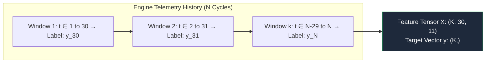
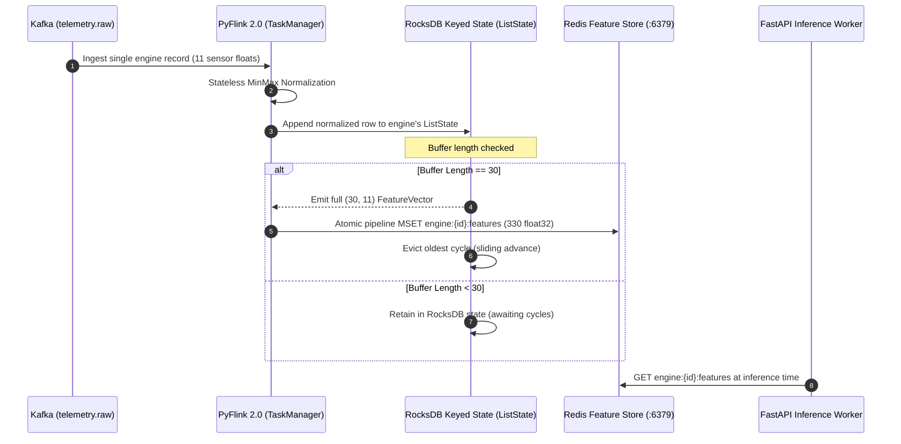

# Feature Engineering Specification

## Temporal Sequence Windowing & Gated Tensor Formatting

The feature engineering stage maps normalized multivariate time-series records into 3D sliding sequence tensors required by Recurrent Neural Networks (GRU), enforcing temporal causality and target normalization.

---

## 🪟 Sliding Temporal Windowing

For each engine $u$, a sliding observation window of length $T = 30$ cycles advances by step size $\Delta t = 1$:

### Tensor Dimensions

* **Sample Matrix $X$**: Shape $\left(K, 30, 11\right)$ where $K = N_u - T + 1$.
* **Target Array $y$**: Shape $\left(K,\right)$ representing normalized RUL at cycle $t + T - 1$.
* **Test Sequence Formulation**: Only the terminal 30-cycle observation window $\left[N_{\text{last}}-29, N_{\text{last}}\right]$ is extracted for each test engine. Engines with history $< 30$ cycles are zero-padded along the front temporal dimension: $\text{pad}(X, (30 - L, 11))$.

---

## 🎯 Target Range Normalization

To ensure gradient stability with Sigmoid output units, RUL labels are normalized into the continuous unit interval $[0.0, 1.0]$:

$$y_{\text{train}} = \frac{RUL_{\text{clipped}}}{125.0}, \quad y_{\text{train}} \in [0.0, 1.0]$$

At inference runtime, the prediction scalar is denormalized:

$$\widehat{RUL}_{\text{cycles}} = \hat{y} \times 125.0$$

---

## ⚡ Real-Time Streaming Feature Assembly

In the production streaming pipeline, sequence tensors are constructed continuously per engine without centralized database scans:

---

## 📦 Artifact Catalog

| Artifact Path | Dimensionality | Description |
| :--- | :--- | :--- |
| `artifacts/data_feature_engineering/X_train.npy` | `(~16000, 30, 11)` | Training sequence tensor (float32) |
| `artifacts/data_feature_engineering/y_train.npy` | `(~16000,)` | Continuous normalized target array |
| `artifacts/data_feature_engineering/X_val.npy` | `(~4000, 30, 11)` | Validation sequence tensor |
| `artifacts/data_feature_engineering/y_val.npy` | `(~4000,)` | Validation target array |
| `artifacts/data_feature_engineering/X_test.npy` | `(100, 30, 11)` | Terminal evaluation sequence per test unit |
| `artifacts/data_feature_engineering/y_test.npy` | `(100,)` | Ground truth RUL values from `RUL_FD001.txt` |
| `artifacts/data_feature_engineering/feature_config.json` | JSON Object | Window dimension ($30$), feature indices, clip value ($125$) |
