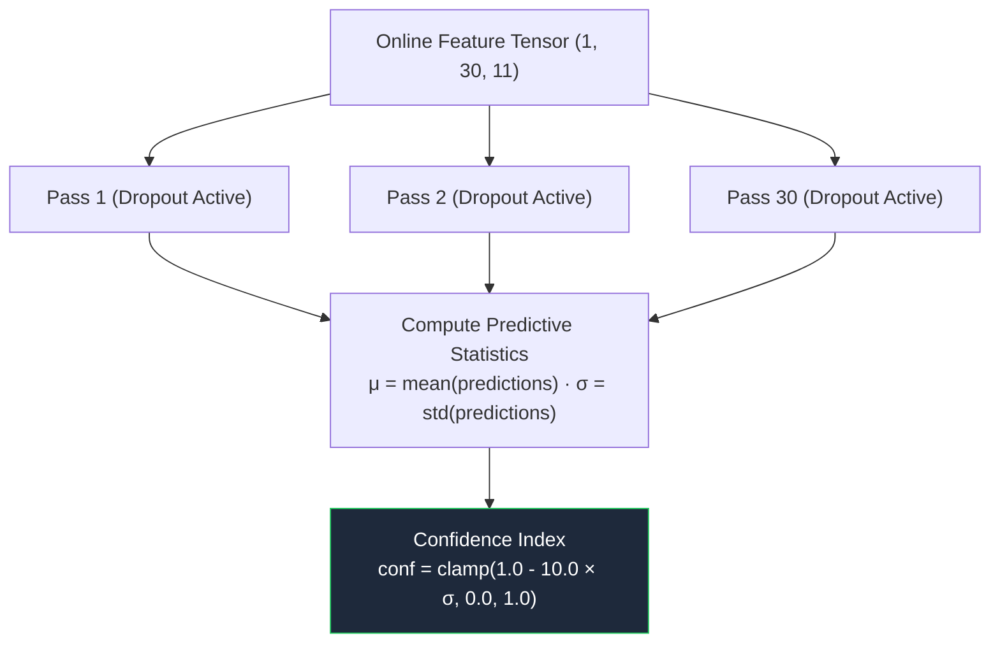
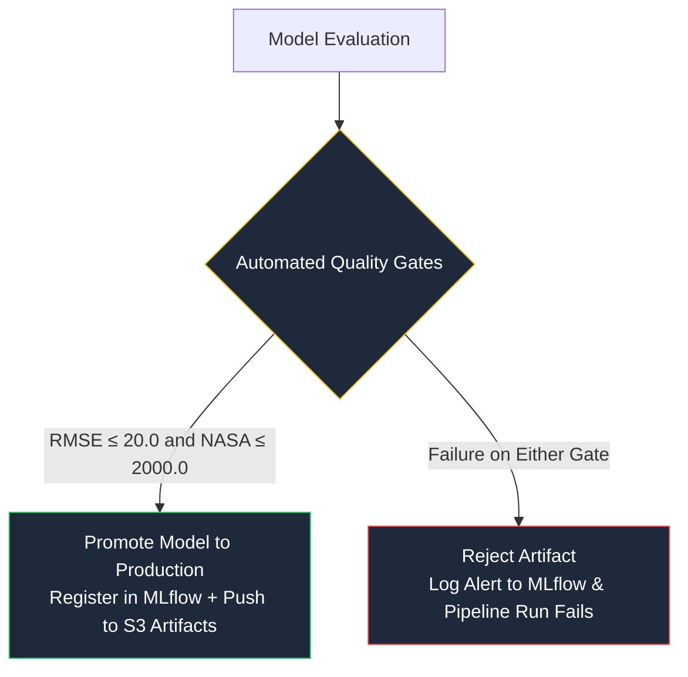

# Model Training & Quality Gate Specification

## 3-Layer GRU Architecture, Epistemic Uncertainty & Registry Promotion

The predictive model addresses multi-sensor temporal degradation using a deep Gated Recurrent Unit (GRU) backbone with Monte Carlo Dropout uncertainty estimation, evaluated against asymmetric operational loss functions.

---

## 🧠 Deep Recurrent Topology

```mermaid
flowchart LR
    IN["Input Tensor\n(B, 30, 11)"] --> G1["GRU Layer 1\n128 Units · return_sequences=True"]
    G1 --> D1["Spatial Dropout\nRate = 0.20"]
    D1 --> G2["GRU Layer 2\n64 Units · return_sequences=True"]
    G2 --> D2["Spatial Dropout\nRate = 0.20"]
    D2 --> G3["GRU Layer 3\n32 Units · return_sequences=False"]
    G3 --> D3["Spatial Dropout\nRate = 0.15"]
    D3 --> FC1["Dense Projection\n32 Units · ReLU · L2 (1e-3)"]
    FC1 --> FC2["Dense Compression\n16 Units · ReLU · L2 (1e-3)"]
    FC2 --> OUT["Sigmoid Unit\n1 Output ∈ 0 to 1"]

    style IN fill:#0369a1,color:#fff
    style OUT fill:#15803d,color:#fff
    style D1 fill:#7e22ce,color:#fff
    style D2 fill:#7e22ce,color:#fff
    style D3 fill:#7e22ce,color:#fff
```

### Design Justification
* **3-Stage Recurrent Compression ($128 \rightarrow 64 \rightarrow 32$)**: The first two layers extract fine-grained temporal dynamics across the 30-cycle observation window. The third GRU layer compresses feature representations into a compact 32-dimensional manifold, reducing overfitting on early flat cycles.
* **Loss Function with Critical-Zone Sample Weighting**: Telemetry near the failure horizon ($RUL \le 30$) carries exponentially higher operational risk. Samples receive dynamic loss weights:

$$w_i = 1.0 + 1.5 \times (1.0 - y_i)$$

$$\mathcal{L}_{\text{weighted}} = \frac{1}{B} \sum_{i=1}^{B} w_i \cdot \left(y_i - \hat{y}_i\right)^2 + \lambda \|\Theta\|_2^2$$

---

## 🎲 Bayesian Uncertainty Quantification (Monte Carlo Dropout)

Traditional deterministic neural networks yield overconfident point predictions. At inference runtime, dropout remains active (`training=True`) across $T = 30$ stochastic forward passes:

$$\mu = \frac{1}{T} \sum_{t=1}^{T} \hat{y}^{(t)}, \qquad \sigma = \sqrt{\frac{1}{T} \sum_{t=1}^{T} \left(\hat{y}^{(t)} - \mu\right)^2}$$

$$\text{Confidence Score} = \max\left(0.0, \, \min\left(1.0, \, 1.0 - 10.0 \cdot \sigma\right)\right)$$

---

## 🚦 Fleet Risk Categorization

| Risk Interval | Operational Category | Action Protocol |
| :--- | :--- | :--- |
| **0.00 – 0.30** | **LOW** | Normal operations; continuous telemetry streaming |
| **0.30 – 0.60** | **MEDIUM** | Heightened sensor polling; evaluate trend at next turnaround |
| **0.60 – 0.80** | **HIGH** | Schedule maintenance depot window within 10 flight cycles |
| **0.80 – 1.00** | **CRITICAL** | Immediate engine dispatch hold; ground inspection required |

$$\text{Risk Score} = 1.0 - \min(1.0, \, \hat{y}_{\text{denorm}} / 125.0)$$

---

## 🏆 Production Promotion Quality Gates

The automated pipeline verifies model artifacts against strict gates before pushing to MLflow Registry and Amazon S3:

### Empirical Validation Suite

| Metric | Target Gate | Validated Model | Benchmark Status |
| :--- | :--- | :--- | :--- |
| **Root Mean Squared Error (RMSE)** | $\le 20.0$ cycles | **14.99 cycles** | **PASS** |
| **NASA Asymmetric Score** | $\le 2000.0$ | **449.6** | **PASS** |
| **Critical Regime Precision** | $> 80.0\%$ | **91.7%** | **PASS** |
| **Critical Regime Recall** | $> 75.0\%$ | **88.0%** | **PASS** |
| **Critical F1 Score** | $> 0.80$ | **0.898** | **PASS** |

#### NASA Asymmetric Scoring Function
Penalizes late predictions (where $\hat{y} > y$, risking unpredicted engine failure) exponentially more than early predictions:

$$d_i = \hat{y}_i - y_i, \qquad S = \sum_{i=1}^{N} h(d_i), \quad h(d_i) = \begin{cases} e^{-d_i/13} - 1, & d_i < 0 \text{ (Early prediction)} \\ e^{d_i/10} - 1, & d_i \ge 0 \text{ (Late prediction)} \end{cases}$$

---

## 📊 Diagnostic Visualizations

| Training and Validation Convergence | True vs Predicted & Residual Error Distribution |
| :---: | :---: |
|  |  |

| RUL Bucket Error Dynamics | Confusion Matrix & Boundary Discrimination |
| :---: | :---: |
|  |  |
