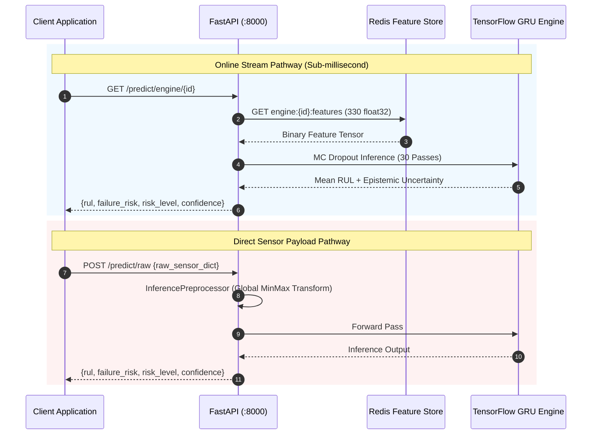
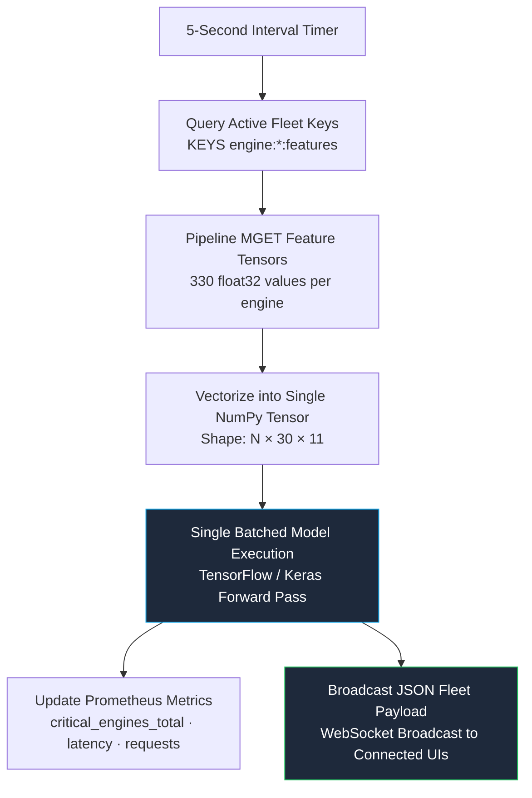
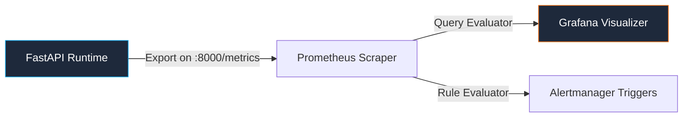

# Inference Service Specification

## Asynchronous Runtime, Vectorized WebSocket Loops & Observability

The inference service is built on FastAPI and Uvicorn, exposing high-throughput REST endpoints, Server-Sent Events (SSE) for pipeline retraining streaming, and low-latency WebSocket channels for fleet-wide continuous predictions.

---

## ⚡ Multi-Pathway Request Lifecycle

---

## 🔄 Vectorized Batch Prediction Loop (`/ws/predictions`)

To eliminate the $O(N)$ computational bottleneck of scoring 100 individual engines sequentially, the background prediction task executes a single vectorized forward pass every 5.0 seconds:

---

## 🔌 API Endpoint Catalog

| Method | Route | Description | Primary Consumers |
| :--- | :--- | :--- | :--- |
| `POST` | `/predict` | Predict from normalized $30 \times 11$ matrix | External ML services |
| `POST` | `/predict/raw` | Transform and predict from unscaled sensor history | Direct IoT integrations |
| `GET`  | `/predict/engine/{id}` | High-speed inference using Redis online features | Dashboard engine detail |
| `GET`  | `/predict/stream/{id}` | Inference against the in-memory push buffer | Simulation & replay lab |
| `POST` | `/push` | Ingest single reading into engine circular buffer | Synthetic replay agents |
| `GET`  | `/engines` | Catalog active engines and health snapshots | Operations overview |
| `GET`  | `/alerts` | Query active HIGH and CRITICAL risk engines | Operational alert systems |
| `GET`  | `/health` | Liveness probe returning component uptimes | Container orchestrators |
| `GET`  | `/model/info` | Return model hyperparameters, input tensor geometry | MLOps dashboards |
| `GET`  | `/model/evaluation` | Real-time metrics read from `metrics.json` | MLOps dashboards |
| `GET`  | `/metrics` | Prometheus exposition format telemetry | Prometheus server |
| `POST` | `/pipeline/run` | Spawn asynchronous non-blocking retraining run | MLOps UI console |
| `GET`  | `/pipeline/status` | Current training state (`idle`, `running`, `success`) | MLOps UI polling |
| `GET`  | `/pipeline/logs` | Server-Sent Events (SSE) execution log stream | Live terminal panels |
| `GET`  | `/drift/reports` | Index generated Evidently AI 0.7 HTML reports | MLOps report viewer |
| `GET`  | `/drift/reports/{file}` | Serve interactive standalone Evidently HTML | In-dashboard iframe |
| `WS`   | `/ws/predictions` | Real-time fleet predictions (5s tick interval) | Fleet overview charts |
| `WS`   | `/ws/telemetry` | Raw cycle and sensor telemetry feed (2s tick) | Telemetry log tables |
| `WS`   | `/ws/alerts` | Urgent fleet health exceptions (5s tick) | Real-time warning banners |

---

## 🗄️ Online Feature Store Architecture (Redis)

| Key Pattern | Data Structure | Payload Specification | TTL Policy |
| :--- | :--- | :--- | :--- |
| `engine:{id}:features` | Binary String | 330 Big-Endian `float32` values ($30 \times 11 = 1320$ bytes) | **3600s** (Sliding refresh) |
| `engine:{id}:meta` | Redis Hash | Fields: `engine_id`, `cycle`, `event_time`, `window_size` | **3600s** (Sliding refresh) |
| `engine:{id}:buffer` | Redis List | JSON string entries containing raw sensor frames | **3600s** (Sliding refresh) |

> **Graceful Failure Signal**: When physical telemetry halts for an engine, the Redis key expires after 1 hour. Subsequent calls return `404 Not Found`, automatically preventing the model from inferring against stale data.

---

## 📊 Prometheus Telemetry Instrumentation

| Metric Identifier | Metric Type | Target Monitored |
| :--- | :--- | :--- |
| `active_engines_total` | **Gauge** | Fleet size currently populated in Redis Feature Store |
| `critical_engines_total` | **Gauge** | Snapshot count of engines in CRITICAL failure regime |
| `prediction_requests_total` | **Counter** | Total predictions served, labeled by `risk_level` |
| `prediction_latency_seconds` | **Histogram** | Execution duration of the batched model forward pass |
| `predicted_rul_cycles` | **Histogram** | Statistical distribution of predicted RUL outputs |
| `failure_risk_score` | **Histogram** | Statistical distribution of normalized risk scores |
| `prediction_confidence` | **Histogram** | Distribution of Bayesian epistemic confidence bounds |
| `prediction_errors_total` | **Counter** | Error count partitioned by exception class |
| `model_load_time_seconds` | **Gauge** | Artifact deserialization latency during cold start |
