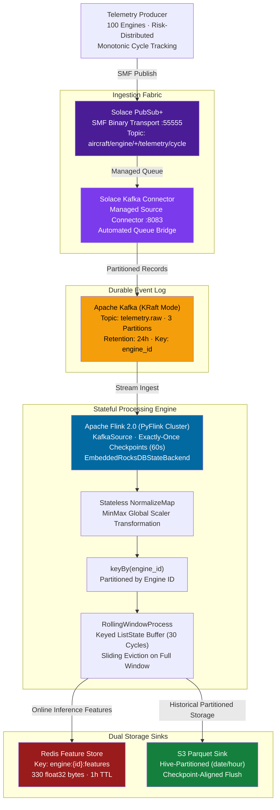
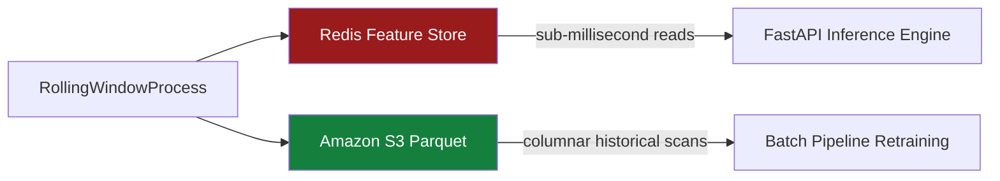
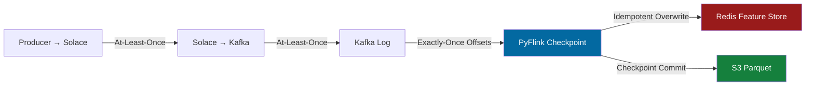

# Streaming Pipeline Specification

## Distributed Telemetry Ingestion, Apache Flink 2.0 & RocksDB State Management

The streaming architecture ingests high-frequency turbofan sensor telemetry across a simulated 100-engine fleet, bridges events across an enterprise message fabric, and executes stateful sliding window aggregations with exactly-once fault tolerance.

---

## 🏗️ End-to-End Streaming Topology

---

## 1. Multi-Tier Ingestion Rationale

Early architectural designs routed telemetry directly into consumer processes or volatile broker queues. This created compounding operational failures under high load:

* **Durability vs. Telemetry Mismatch**: In-memory message queues lack configurable retention and replay semantics on restart, causing unrecoverable data loss during pipeline maintenance.
* **Decoupled JVM Bridging**: The Solace-to-Kafka connector runs as a managed source connector within Kafka Connect, completely isolating message broker protocols from the application runtime.
* **Pure Python Stream Reliability**: Flink consumes from Kafka via `KafkaSource` using standard Kafka consumer protocols, eliminating unstable JNI/JNDI bridges inside Python worker containers.

---

## 2. Component Specifications

### A. Telemetry Fleet Producer
* **Simulated Fleet Scale**: 100 concurrent turbofan engines.
* **Risk-Distributed State**: Offsets ensure a continuous, realistic fleet distribution:
  * **70% LOW Risk** (Nominal degradation, early lifecycle)
  * **10% MEDIUM Risk** (Noticeable wear trends)
  * **10% HIGH Risk** (Accelerated degradation curve)
  * **10% CRITICAL Risk** (Terminal failure horizon, $RUL < 30$)
* **Batch Throttle**: Inter-message delay is evaluated **once per round of 100 engines**, ensuring all engines populate their 30-cycle rolling windows synchronously on cold start.

### B. Solace PubSub+ Message Broker
* **Wire Protocol**: Solace Message Format (SMF) over binary port `:55555`.
* **Topic Taxonomy**: `aircraft/engine/{engine_id}/telemetry/cycle`
* **Wildcard Subscription**: `aircraft/engine/+/telemetry/cycle` routes all 100 aircraft streams into the durable spool `flink.feature.processor`.

### C. Apache Kafka Event Log
* **Cluster Architecture**: KRaft mode (Zero ZooKeeper dependencies).
* **Topic Configuration**: `telemetry.raw` partitioned into 3 independent shards matching 3 Flink task slots.
* **Partition Affinity**: `engine_id` is assigned as the Kafka message key, guaranteeing strict in-order delivery per engine across network rebalances.

### D. PyFlink 2.0 Streaming Engine
* **Execution Environment**: Distributed cluster (JobManager `:8082`, TaskManager with 3 task slots).
* **State Management**: `EmbeddedRocksDBStateBackend` storing keyed `ListState` out-of-core. This enables fast incremental checkpointing without garbage-collection pauses.
* **Window Mechanics**: Keyed process function maintains an ordered sliding buffer of length $T = 30$. When cycle count reaches 30, the operator emits a `FeatureVector` and slides forward by dropping the oldest cycle index.

---

## 3. Dual Sink Contracts

| Dimension | Online Store (Redis) | Offline Store (Amazon S3) |
| :--- | :--- | :--- |
| **Target Audience** | Low-latency inference serving | Offline retraining & drift baseline |
| **Record Format** | Binary IEEE-754 `float32` (1320 bytes) | Snappy-compressed Apache Parquet |
| **Key / Path Schema** | `engine:{id}:features` | `features/date=YYYY-MM-DD/hour=HH/` |
| **Write Guarantee** | Atomic pipeline `MSET` (idempotent) | Checkpoint-aligned file flush |
| **Eviction Policy** | **3600s TTL** (automatic stale engine pruning) | Immutable long-term retention |

---

## 4. End-to-End Exactly-Once Guarantees

| Boundary Segment | Technical Mechanism | Guarantee Level |
| :--- | :--- | :--- |
| **Producer $\rightarrow$ Solace** | SMF broker acknowledgment | **At-Least-Once** |
| **Solace $\rightarrow$ Kafka** | Kafka Connect record offset commit | **At-Least-Once** |
| **Kafka $\rightarrow$ PyFlink** | Checkpoint-committed Kafka consumer offsets | **Exactly-Once** |
| **PyFlink $\rightarrow$ Redis** | Key-deterministic idempotent `MSET` overwrite | **Effectively Exactly-Once** |
| **PyFlink $\rightarrow$ S3** | `notifyCheckpointComplete` transactional flush | **Exactly-Once** |

> **Convergence Property**: Because Redis keys are keyed deterministically by engine ID (`engine:ENG-042:features`), upstream network retries safely overwrite identical tensor bytes, guaranteeing consistent inference features at all times.
