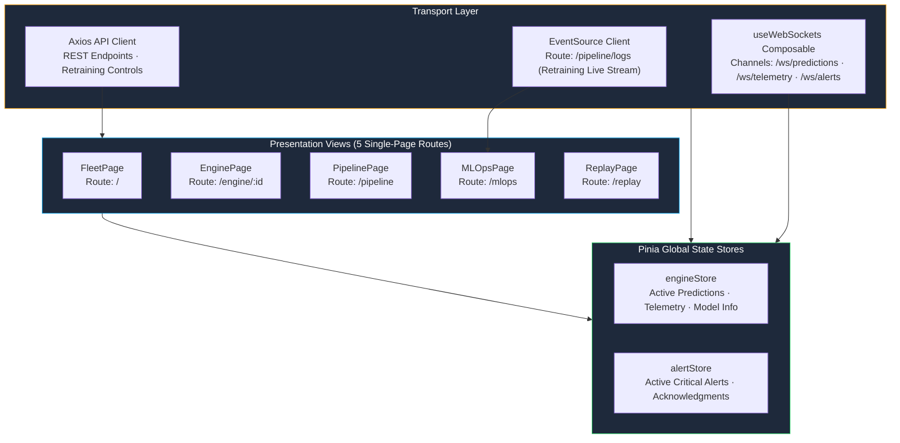
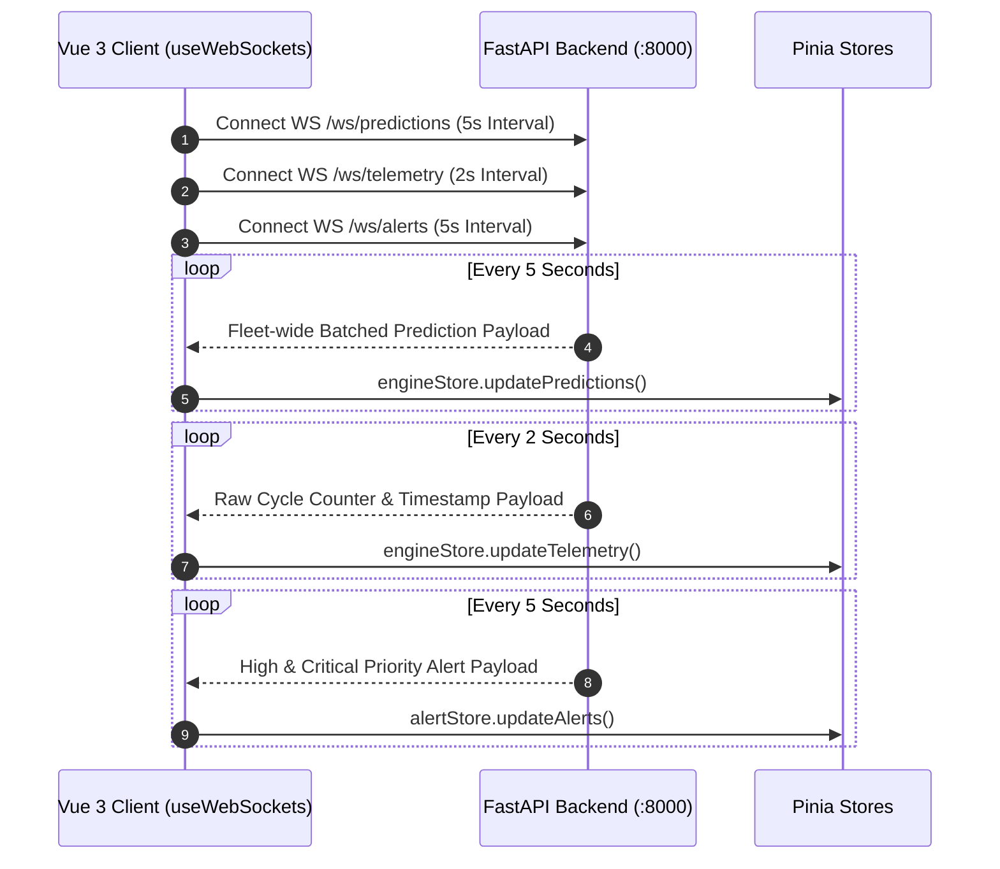

# Operations Dashboard UI Specification

## Reactive Fleet Control Center: Vue 3, TypeScript, TailwindCSS & Multi-Channel WebSockets

The frontend provides real-time fleet operations, pipeline status tracking, MLOps model monitoring, and interactive hardware-in-the-loop simulation.

---

## 🏗️ Reactive Component & State Topology

---

## 🖥️ Operational Views

### Page 1 — Fleet Command Center (`/`)
* Real-time fleet KPI widgets: Active Fleet Size, Critical Engines, High Risk Engines, Mean Fleet RUL.
* Dynamic Apache ECharts risk distribution donut and high-risk fleet ranking bar charts.
* Sortable, filterable engine status grid with immediate navigation to individual units.

---

### Page 2 — Individual Engine Deep Dive (`/engine/:id`)
* Circular SVG health and risk gauge with animated gradient interpolation.
* Predicted Remaining Useful Life (RUL) with Monte Carlo Dropout Bayesian confidence score.
* 11-channel live telemetry sensor readouts with nominal bounds comparison.

---

### Page 3 — Streaming Pipeline Monitor (`/pipeline`)
* Live 8-stage streaming topology diagram with active status indicators.
* Real-time telemetry feed table tracking per-engine window completion and latest event timestamps.
* Microservice health probe matrix covering FastAPI, Redis, Solace, Kafka, and Flink.

---

### Page 4 — ML Observability & Retraining Portal (`/mlops`)
* Real-time model metadata: Layer architecture, parameter count, input tensor geometry.
* Animated SVG visualization of the 3-layer GRU recurrent network.
* Asynchronous retraining trigger with live terminal log streaming via Server-Sent Events (SSE).
* Embedded interactive Evidently AI 0.7 drift reports in an integrated modal viewport.

---

### Page 5 — Hardware-in-the-Loop Simulation Lab (`/replay`)
* Telemetry playback simulator with selectable velocity multipliers ($\times 1, \times 5, \times 10, \times 20$).
* Fault injection modes:
  * **🔥 Thermal Runaway**: High-pressure turbine outlet sensors spiked $+25\%$.
  * **📉 Compressor Pressure Loss**: Core static pressure drops $-30\%$.
  * **📳 Rotational Vibration**: Core speed telemetry oscillates with amplified variance.
* Real-time inference reaction stream observing RUL degradation response.

---

## ⚡ Multi-Channel WebSocket Protocol

All continuous telemetry is ingested over three dedicated WebSocket channels initialized on application mount:

---

## 📦 Pinia Store Contracts

| Store Name | Primary State Properties | Ingestion Mechanism |
| :--- | :--- | :--- |
| `engineStore` | `predictions: Record<string, EnginePrediction>` `telemetry: Record<string, EngineTelemetry>` `modelInfo: ModelInfo \| null` `isConnected: boolean` | Populated via `/ws/predictions`, `/ws/telemetry`, and `/model/info` |
| `alertStore` | `alerts: AlertItem[]` `acknowledgedIds: Set<string>` | Populated via `/ws/alerts` with client-side acknowledgment filtering |
