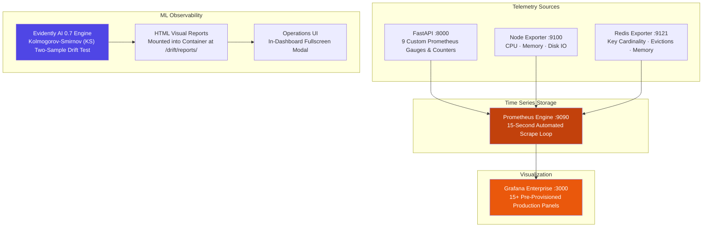
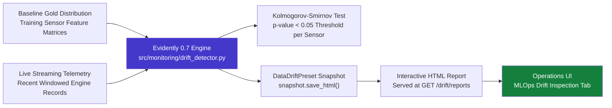

# Monitoring & Observability Specification

## Distributed System Telemetry, Grafana Dashboards & Sensor Drift Analysis

The platform implements a multi-tier observability architecture spanning infrastructure performance, microservice health, and statistical machine learning drift.

---

## 🔭 Multi-Tier Observability Architecture

---

## 1. Prometheus Telemetry Matrix

Custom metrics instrumented within `src/inference/metrics.py` and exposed at `GET /metrics`:

| Metric Identifier | Class | Labels | Operational Semantics |
| :--- | :--- | :--- | :--- |
| `active_engines_total` | **Gauge** | None | Real-time count of engines maintaining active feature vectors in Redis |
| `critical_engines_total` | **Gauge** | None | Instantaneous count of engines operating within the critical failure envelope |
| `prediction_requests_total` | **Counter** | `engine_id`, `risk_level` | Monotonic count of total inferences scored across all pathways |
| `prediction_latency_seconds` | **Histogram** | None | Execution duration of the batched GRU model inference pass |
| `predicted_rul_cycles` | **Histogram** | None | Empirical distribution of denormalized RUL predictions across the fleet |
| `failure_risk_score` | **Histogram** | None | Distribution of fleet failure risk scores $[0.0, 1.0]$ |
| `prediction_confidence` | **Histogram** | None | Epistemic confidence scores derived from Monte Carlo Dropout variance |
| `prediction_errors_total` | **Counter** | `error_type` | Diagnostic counter capturing tensor shape mismatches or Redis timeouts |
| `model_load_time_seconds` | **Gauge** | None | Cold-start model deserialization and warm-up latency |

---

## 2. Automated Alerting Matrix

Rules defined within `monitoring/prometheus/alerting_rules.yml`:

| Alert Identifier | Threshold Expression | Evaluation Duration | Severity Level |
| :--- | :--- | :--- | :--- |
| `CriticalEngineDetected` | `rate(critical_engines_total[5m]) > 0` | 1 minute | **CRITICAL** |
| `HighPredictionLatency` | `p95(prediction_latency) > 100ms` | 5 minutes | **WARNING** |
| `HighPredictionErrorRate` | `rate(prediction_errors_total[5m]) > 0.01/s` | 5 minutes | **WARNING** |
| `RedisHighMemoryUsage` | `redis_memory_used / redis_memory_max > 80%` | 5 minutes | **WARNING** |
| `InferenceEngineDown` | `up{job="inference-api"} == 0` | 1 minute | **CRITICAL** |

---

## 3. Evidently AI 0.7 Sensor Drift Engine

Sensor drift indicates physical turbofan wear, calibration degradation, or operating condition shifts:

### Statistical Verification
* **Algorithm**: Non-parametric two-sample Kolmogorov-Smirnov (KS) test per sensor channel.
* **Null Hypothesis ($H_0$)**: Incoming telemetry samples originate from the baseline training distribution.
* **Drift Threshold**: Feature flagged as drifted if KS test $p$-value $< 0.05$.
* **Evidently 0.7 API Contract**: `report.run()` returns a `Snapshot` object, calling `snapshot.save_html()` on the snapshot directly.

---

## 4. Structured Operational Logging

The inference engine emits JSON structured log events with consistent audit fields:

| Field | Type | Description |
| :--- | :--- | :--- |
| `timestamp` | ISO-8601 | UTC microsecond timestamp |
| `level` | String | Log severity (`INFO`, `WARNING`, `ERROR`) |
| `engine_id` | String | Unique aircraft engine identifier |
| `rul` | Float | Predicted remaining flight cycles |
| `failure_risk` | Float | Normalized risk score $[0.0, 1.0]$ |
| `risk_level` | String | Categorical status (`LOW`, `MED`, `HIGH`, `CRITICAL`) |
| `confidence` | Float | Bayesian confidence index $[0.0, 1.0]$ |
| `latency_ms` | Float | End-to-end forward pass execution time |
