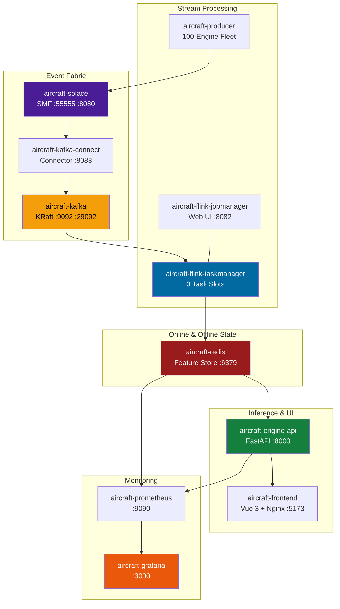

# Project Structure & Microservice Topology

## Codebase Organization, MLOps Stages & Container Orchestration

A modular monorepo cleanly separating ML lifecycle pipelines, streaming workers, asynchronous inference runtimes, and frontend presentation layers.

---

## 🗂️ Monorepo Architecture

```
Real-Time-Aircraft-Engine-Predictive-Maintenance-System/
├── Dataset/                           # NASA C-MAPSS FD001 reference data & research paper
│   ├── Damage Propagation Modeling.pdf
│   ├── RUL_FD001.txt                  # Test set ground truth RUL values (100 engines)
│   ├── test_FD001.txt                 # Test sensor telemetry (truncated before failure)
│   └── train_FD001.txt                # Training run-to-failure telemetry (100 engines, 20,631 cycles)
├── config/                            # Pipeline, model, and infrastructure YAML definitions
│   ├── config.yaml                    # S3 paths, data lake buckets, artifact locations
│   ├── features.yaml                  # Feature selection (11 sensors), window geometry (30x11)
│   ├── flink.yaml                     # Flink cluster, parallelism, checkpointing config
│   ├── kafka.yaml                     # Kafka broker, topic names, partition count, retention
│   ├── model.yaml                     # 3-layer GRU hyperparameters & L2 regularization
│   ├── params.yaml                    # Training hyperparameters (Adam, lr=0.0003, batch=256)
│   ├── redis.yaml                     # Feature store host, connection pool, TTL (3600s)
│   ├── registor.yaml                  # MLflow quality gate thresholds (RMSE < 20, NASA < 2000)
│   ├── schema.yaml                    # Telemetry schema & sensor validation constraints
│   ├── solace_kafka_connector.json    # Solace Kafka Source Connector definition
│   └── transform.yaml                 # Scaler type and RUL clip threshold (125)
├── src/                               # Core Python ML and backend microservices
│   ├── cloud/                         # AWS S3 data lake client wrapper
│   │   └── s3.py
│   ├── components/                    # 7 modular pipeline stage implementations
│   │   ├── data_ingestion.py          # Stage 1: S3 Bronze to local ingestion
│   │   ├── data_validation.py         # Stage 2: Schema validation & null checks
│   │   ├── data_transformation.py     # Stage 3: Sensor filtering, RUL clipping, MinMaxScaler
│   │   ├── feature_engineering.py     # Stage 4: 30x11 sliding window tensor generation
│   │   ├── model_training.py          # Stage 5: 3-layer GRU training with sample weighting
│   │   ├── model_evaluation.py        # Stage 6: Multi-metric evaluation (RMSE, NASA, F1)
│   │   └── model_registry.py          # Stage 7: Quality gates, MLflow logging, S3 promotion
│   ├── pipeline/                      # Orchestrators executing each stage sequentially
│   │   ├── data_ingestion_pipeline.py
│   │   ├── data_validation_pipeline.py
│   │   ├── data_transformation_pipeline.py
│   │   ├── feature_engineering_pipeline.py
│   │   ├── model_trainer_pipeline.py
│   │   ├── model_evaluation_pipeline.py
│   │   └── model_registry_pipeline.py
│   ├── inference/                     # FastAPI inference runtime & WebSocket engine
│   │   ├── app.py                     # FastAPI application setup, CORS, lifespan
│   │   ├── routes.py                  # REST endpoints (/predict, /pipeline, /drift)
│   │   ├── ws.py                      # Multi-channel WebSocket endpoints & batch loop
│   │   ├── predictor.py               # Monte Carlo Dropout inference & confidence scoring
│   │   ├── preprocessor.py            # Raw sensor transform & validation
│   │   ├── feature_store.py           # Redis online feature store client
│   │   ├── buffer.py                  # Circular push buffer for simulation lab
│   │   ├── loader.py                  # Startup artifact loader (model & scaler)
│   │   ├── metrics.py                 # 9 custom Prometheus metric definitions
│   │   └── structured_logger.py       # JSON formatted structured logging
│   ├── monitoring/                    # Statistical drift detection
│   │   ├── drift_detector.py          # Evidently AI 0.7 KS-test drift detector
│   │   └── drift_monitor.py           # Standalone drift evaluation runner
│   ├── metrics/                       # Evaluation scoring algorithms
│   │   ├── scores.py                  # Custom RMSE and NASA asymmetric penalty scores
│   │   └── plot.py                    # Residual error & confusion matrix plotting
│   ├── config/                        # Configuration manager reading YAML specs
│   │   └── configuration.py
│   ├── entity/                        # Pydantic & dataclass configuration entities
│   │   └── config_entity.py
│   ├── exception/                     # Custom exception classes with file & line traceback
│   │   └── exception.py
│   ├── logging/                       # Rotating pipeline file logger
│   │   └── logger.py
│   └── utils/                         # Shared utility functions & MLflow helpers
│       ├── common.py
│       ├── mlflow_setup.py
│       └── suppress_warnings.py
├── streaming/                         # Real-time distributed stream processing
│   ├── config/                        # Broker connection environment templates
│   │   ├── solace.env                 # Solace connection settings (ignored by git)
│   │   └── solace.env.example         # Documented Solace environment template
│   ├── model/                         # Telemetry event schemas & serialization
│   │   ├── engine_event.py            # Ingestion event dataclass (JSON)
│   │   └── feature_vector.py          # 30x11 FeatureVector tensor binary serializer
│   ├── pipeline/                      # PyFlink streaming application
│   │   ├── telemetry_pipeline.py      # PyFlink cluster job (KafkaSource, RocksDB window)
│   │   ├── standalone_consumer.py     # Standalone Python consumer fallback
│   │   ├── functions/                 # Stream transformation operators
│   │   │   ├── normalization.py       # Stateless MinMax normalization map
│   │   │   └── rolling_window.py      # 30-cycle keyed ListState window process
│   │   └── sinks/                     # Dual stream sinks
│   │       ├── redis_sink.py          # Online feature store sink (engine:{id}:features)
│   │       └── s3_parquet_sink.py     # Offline Parquet sink (Hive-partitioned)
│   ├── producer/                      # Synthetic telemetry generator
│   │   └── telemetry_producer.py      # 100-engine fleet simulator with risk distribution
│   └── src/main/resources/            # Baked streaming artifacts (scaler_params.csv)
├── frontend/                          # Vue 3 + Vite + TypeScript operations dashboard
│   ├── src/
│   │   ├── pages/                     # 5 single-page operational views
│   │   │   ├── FleetPage.vue          # / — Fleet Command Center & KPI cards
│   │   │   ├── EnginePage.vue         # /engine/:id — Individual engine diagnostics
│   │   │   ├── PipelinePage.vue       # /pipeline — Streaming topology & service health
│   │   │   ├── MLOpsPage.vue          # /mlops — Retraining, GRU visualizer, Evidently
│   │   │   └── ReplayPage.vue         # /replay — Hardware-in-the-loop simulation lab
│   │   ├── components/                # Reusable UI widgets & ECharts charts
│   │   │   ├── ModelArchDiagram.vue   # Animated SVG GRU architecture diagram
│   │   │   ├── cards/                 # StatCard, EngineTable, AlertsPanel
│   │   │   └── charts/                # RiskDistributionChart, RulBarChart
│   │   ├── stores/                    # Pinia global reactive state stores
│   │   │   ├── engineStore.ts         # Real-time fleet predictions & telemetry map
│   │   │   └── alertStore.ts          # Active alerts & user acknowledgment state
│   │   ├── composables/               # Composable abstractions
│   │   │   └── useWebSockets.ts       # 3-channel WebSocket client connection manager
│   │   ├── services/                  # Backend communication
│   │   │   ├── api.ts                 # Axios REST client & SSE log streaming
│   │   │   └── websocket.ts           # WebSocket connection factory
│   │   ├── router/                    # Vue Router client-side route definitions
│   │   ├── types/                     # TypeScript interfaces & domain types
│   │   ├── App.vue                    # Root application component
│   │   ├── main.ts                    # Application bootstrapper
│   │   └── style.css                  # Global Tailwind CSS directives & custom styles
│   ├── package.json                   # Node dependencies & build scripts
│   ├── vite.config.ts                 # Vite bundler & development proxy config
│   └── tailwind.config.js             # Tailwind theme & color token extensions
├── monitoring/                        # Infrastructure & metrics observability
│   ├── prometheus/
│   │   ├── prometheus.yml             # Scrape targets (API, node, redis-exporter)
│   │   └── alerting_rules.yml         # 5 automated Prometheus alerting rules
│   └── grafana/
│       ├── dashboards/
│       │   └── aircraft_engine_monitoring.json # 15+ panel production dashboard
│       └── provisioning/              # Automated datasource & dashboard providers
├── scripts/                           # Operational utilities & container entrypoints
│   ├── export_scaler_params.py        # Extracts scaler bounds to CSV for Flink
│   ├── install_flink.sh               # Local bare-metal PyFlink installer helper
│   ├── provision_solace_queues.sh     # Solace SEMP API provisioner (Docker entrypoint)
│   └── register_kafka_connector.sh    # Kafka Connect registrar (Docker entrypoint)
├── reports/drift/                     # Persisted Evidently AI 0.7 HTML drift reports
├── artifacts/                         # Generated ML pipeline binaries & evaluation assets
│   ├── data_transformation/scaler.pkl # Fitted MinMaxScaler
│   ├── model_trainer/model.keras      # Trained 3-layer GRU Keras model
│   └── model_evaluation/metrics.json  # Benchmarking metrics & test score results
├── assets/                            # Architecture diagrams, UI screenshots & charts
├── test/                              # Automated test suites
│   ├── test_inference.py              # REST API inference test cases
│   └── test_stream_inference.py       # WebSocket & stream prediction test cases
├── docker-compose.yml                 # 13-service container orchestration with profiles
├── Dockerfile                         # Inference API container image (Python 3.12-slim)
├── Dockerfile.frontend                # Frontend container image (Node build + Nginx)
├── Dockerfile.streaming               # Streaming producer & Flink TaskManager image
├── Dockerfile.kafka-connect           # Kafka Connect image with Solace connector plugin
├── nginx.conf                         # Reverse proxy configuration for frontend container
├── main.py                            # 7-stage ML pipeline CLI entrypoint
├── app.py                             # Uvicorn entrypoint for FastAPI
├── pyproject.toml                     # uv package manager dependencies & project metadata
├── uv.lock                            # Deterministic dependency lockfile
├── .env.example                       # AWS & MLflow environment variable template
└── solace.env.example                 # Solace & Redis environment variable template
```

---

## 🔄 7-Stage Pipeline Lifecycle


---

## 🐳 Containerized Service Topology



---

## ⚙️ Microservice Resource Allocation

| Container Service | Base Image | Memory Limit | CPU Limit | Primary Responsibility |
| :--- | :--- | :--- | :--- | :--- |
| `aircraft-engine-api` | `python:3.12-slim` | **1.5 GB** | 2.0 cores | FastAPI, TensorFlow runtime, model inference |
| `aircraft-frontend` | `nginx:alpine` | **256 MB** | 0.5 cores | Static SPA hosting & API reverse proxy |
| `aircraft-redis` | `redis:7.2-alpine` | **256 MB** | 1.0 cores | Sub-millisecond online feature store |
| `aircraft-solace` | `solace-pubsub-standard` | **1.5 GB** | 2.0 cores | Ingestion SMF message broker |
| `aircraft-kafka` | `cp-kafka:7.6.0` | **1.0 GB** | 1.5 cores | Durable partitioned telemetry log |
| `aircraft-kafka-connect` | `cp-kafka-connect:7.6.0` | **768 MB** | 1.0 cores | Solace-to-Kafka automated source connector |
| `aircraft-flink-jobmanager` | `flink:2.0-scala_2.12` | **1.0 GB** | 1.0 cores | Flink cluster coordination & Web UI |
| `aircraft-flink-taskmanager` | `Dockerfile.streaming` | **1.5 GB** | 2.0 cores | PyFlink operator execution & RocksDB |
| `aircraft-producer` | `Dockerfile.streaming` | **256 MB** | 0.5 cores | 100-engine fleet telemetry simulation |
| `aircraft-prometheus` | `prometheus:v2.50.0` | **256 MB** | 0.5 cores | Metric collection & rule evaluation |
| `aircraft-grafana` | `grafana:10.3.0` | **256 MB** | 0.5 cores | Production visual analytics dashboard |
| `aircraft-node-exporter` | `node-exporter:v1.7.0` | **128 MB** | 0.2 cores | Host hardware & OS metrics |
| `aircraft-redis-exporter` | `redis_exporter:v1.58.0` | **128 MB** | 0.2 cores | Redis memory, command, & key metrics |
