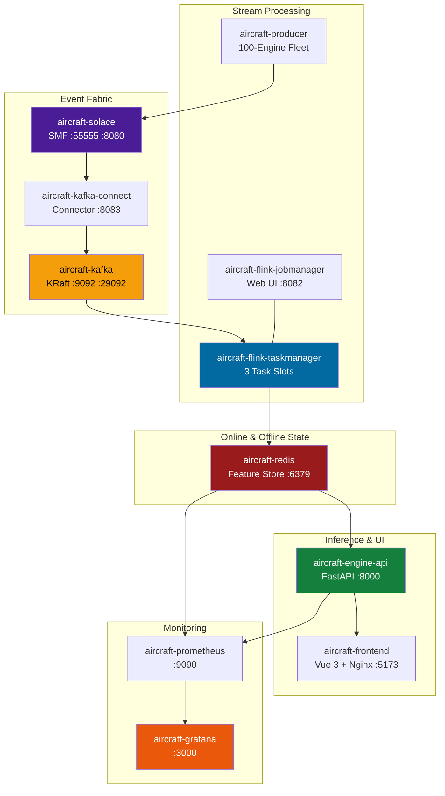

# Project Structure & Microservice Topology

## Codebase Organization, MLOps Stages & Container Orchestration

A modular monorepo cleanly separating ML lifecycle pipelines, streaming workers, asynchronous inference runtimes, and frontend presentation layers.

---

## 🗂️ Monorepo Architecture

```
Real-Time-Aircraft-Engine-Predictive-Maintenance-System/
├── Dataset/                 # C-MAPSS FD001 raw reference telemetry
├── config/                  # Pipeline, model, and infrastructure YAML definitions
│   ├── config.yaml          # S3 paths, artifact storage schemas
│   ├── features.yaml        # Sensor selection, window geometry (30x11)
│   ├── model.yaml           # 3-layer GRU hyperparameters & regularization
│   ├── params.yaml          # Adam optimizer learning rate, batch size, epochs
│   ├── redis.yaml           # Feature store host, connection pool, TTL
│   ├── registor.yaml        # MLflow quality gate thresholds
│   └── schema.yaml          # Telemetry column validation constraints
├── src/                     # Core Python ML and backend microservices
│   ├── components/          # 7 pipeline stage implementations
│   ├── pipeline/            # Orchestrators executing each stage
│   ├── inference/           # FastAPI application, WebSockets, feature store client
│   ├── monitoring/          # Evidently AI 0.7 KS-drift detector
│   ├── cloud/               # AWS S3 client wrapper
│   └── metrics/             # Custom RMSE and NASA asymmetric scoring logic
├── streaming/               # Real-time distributed stream processing
│   ├── producer/            # Risk-distributed 100-engine fleet simulator
│   ├── pipeline/            # PyFlink 2.0 streaming pipeline & operators
│   │   ├── functions/       # Stateless normalization & RocksDB windowing
│   │   └── sinks/           # Redis feature store & S3 Parquet sinks
│   └── model/               # Event & FeatureVector data serialization
├── frontend/                # Vue 3 + Vite + TypeScript operations dashboard
│   └── src/
│       ├── pages/           # 5 operational SPA views
│       ├── components/      # ECharts widgets, SVG network diagrams
│       ├── stores/          # Pinia reactive state stores
│       └── composables/     # Multi-channel WebSocket management
├── monitoring/              # Infrastructure observability definitions
│   ├── prometheus/          # Scrape targets & alerting rule YAMLs
│   └── grafana/             # Auto-provisioned 15-panel JSON dashboards
├── reports/drift/           # Persisted Evidently AI 0.7 HTML drift reports
├── artifacts/               # Generated pipeline binaries, scalers, and metrics
└── docker-compose.yml       # 13-service microservice orchestration
```

---

## 🔄 7-Stage Pipeline Lifecycle


---

## 🐳 Containerized Service Topology



---

## ⚙️ Microservice Resource Allocation

| Container Service | Base Image | Memory Limit | CPU Limit | Primary Responsibility |
| :--- | :--- | :--- | :--- | :--- |
| `aircraft-engine-api` | `python:3.12-slim` | **1.5 GB** | 2.0 cores | FastAPI, TensorFlow runtime, model inference |
| `aircraft-frontend` | `nginx:alpine` | **256 MB** | 0.5 cores | Static SPA hosting & API reverse proxy |
| `aircraft-redis` | `redis:7.2-alpine` | **256 MB** | 1.0 cores | Sub-millisecond online feature store |
| `aircraft-solace` | `solace-pubsub-standard` | **1.5 GB** | 2.0 cores | Ingestion SMF message broker |
| `aircraft-kafka` | `cp-kafka:7.6.0` | **1.0 GB** | 1.5 cores | Durable partitioned telemetry log |
| `aircraft-kafka-connect` | `cp-kafka-connect:7.6.0` | **768 MB** | 1.0 cores | Solace-to-Kafka automated source connector |
| `aircraft-flink-jobmanager` | `flink:2.0-scala_2.12` | **1.0 GB** | 1.0 cores | Flink cluster coordination & Web UI |
| `aircraft-flink-taskmanager` | `Dockerfile.streaming` | **1.5 GB** | 2.0 cores | PyFlink operator execution & RocksDB |
| `aircraft-producer` | `Dockerfile.streaming` | **256 MB** | 0.5 cores | 100-engine fleet telemetry simulation |
| `aircraft-prometheus` | `prometheus:v2.50.0` | **256 MB** | 0.5 cores | Metric collection & rule evaluation |
| `aircraft-grafana` | `grafana:10.3.0` | **256 MB** | 0.5 cores | Production visual analytics dashboard |
| `aircraft-node-exporter` | `node-exporter:v1.7.0` | **128 MB** | 0.2 cores | Host hardware & OS metrics |
| `aircraft-redis-exporter` | `redis_exporter:v1.58.0` | **128 MB** | 0.2 cores | Redis memory, command, & key metrics |
