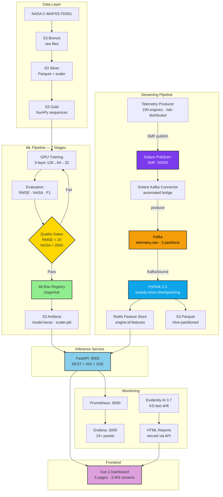
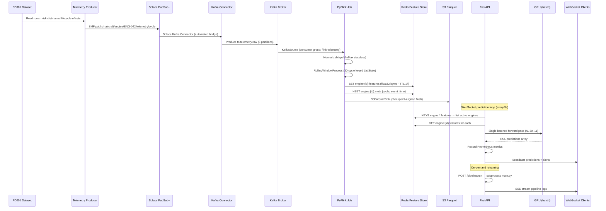
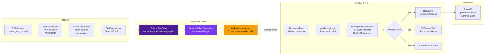
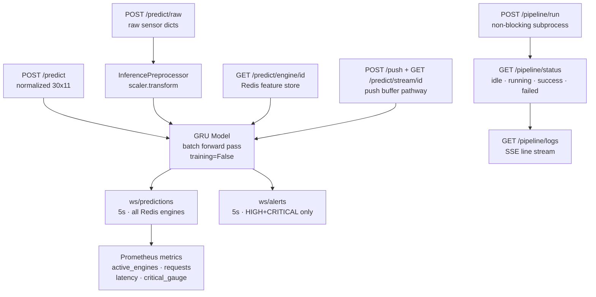
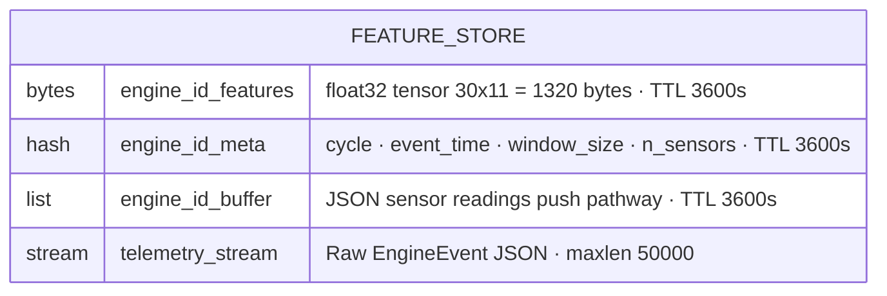
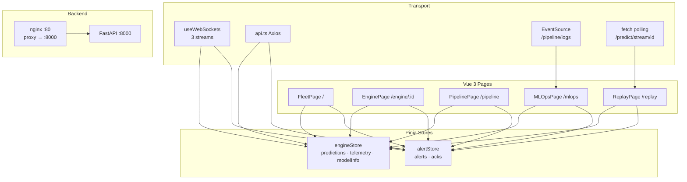
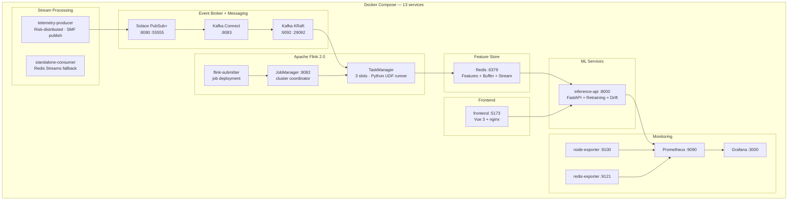
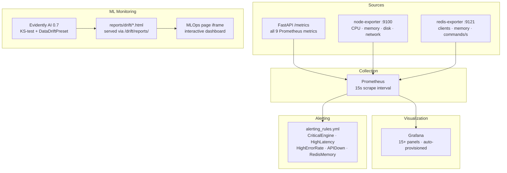

# System Architecture

## High-Level Architecture

---

## Data Flow

---

## Streaming Pipeline Detail

---

## Inference Service Architecture

---

## Redis Key Schema

---

## Frontend Architecture

---

## Deployment Architecture

---

## Monitoring Architecture

