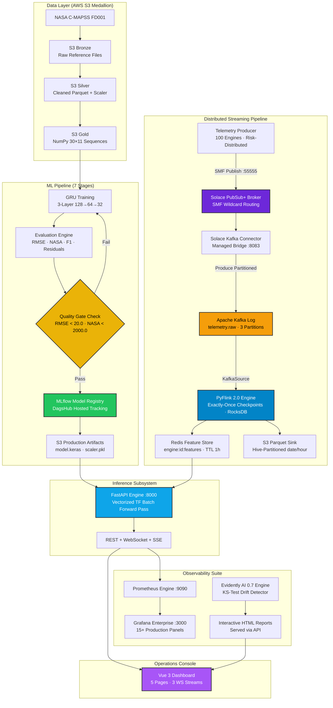
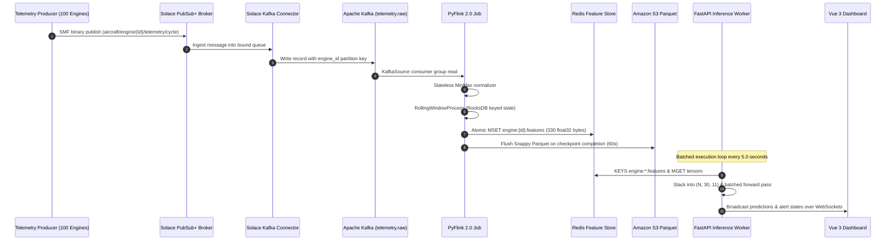
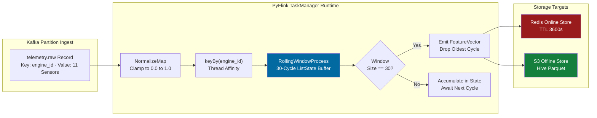
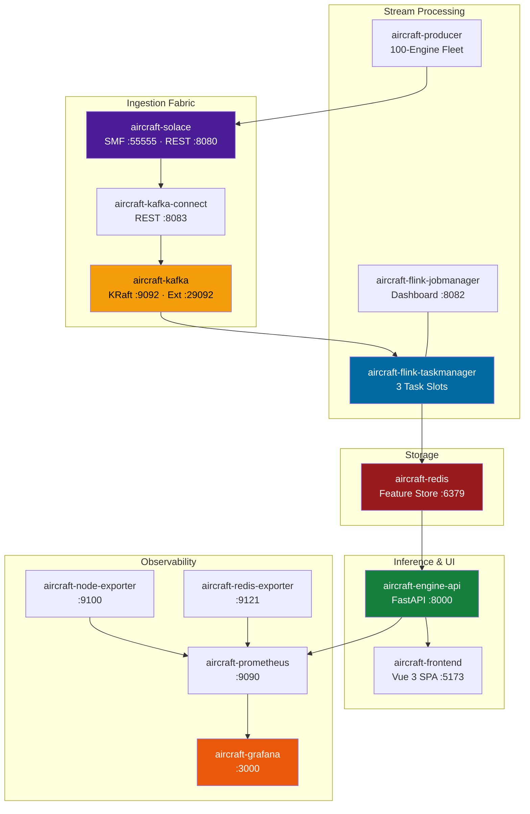

# System Architecture Specification

## Multi-Tier Architecture, Real-Time Ingestion Sequences & Network Topology

An end-to-end specification of data flow across the ingestion fabric, stream windowing engine, online feature store, asynchronous inference runtime, and monitoring subsystem.

---

## 🏛️ Multi-Tier Architecture Topology

---

## ⚡ End-to-End Lifecycle Sequence

---

## 🌊 Streaming Windowing Mechanics

---

## 🖥️ Containerized Infrastructure Mesh

